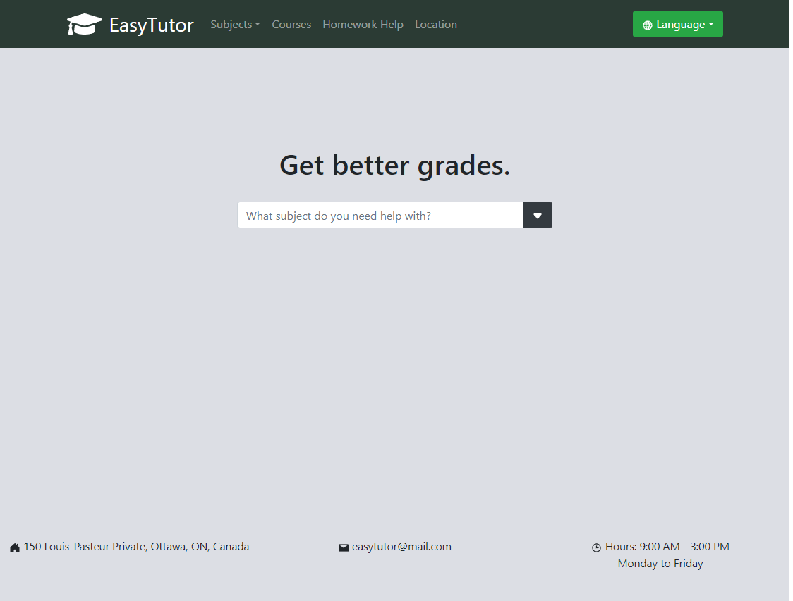
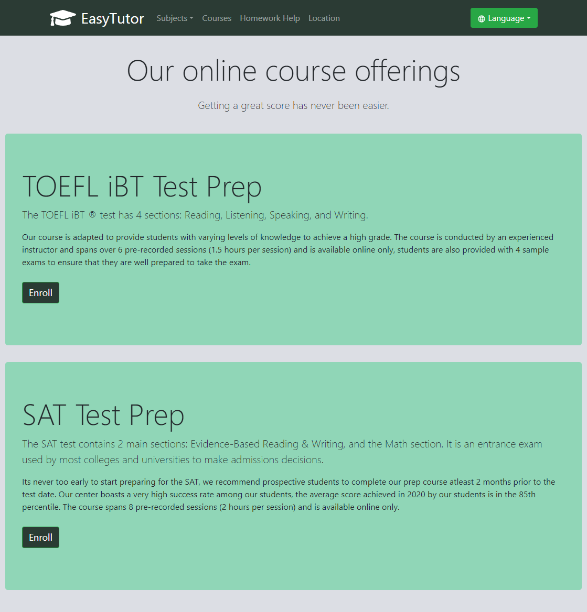
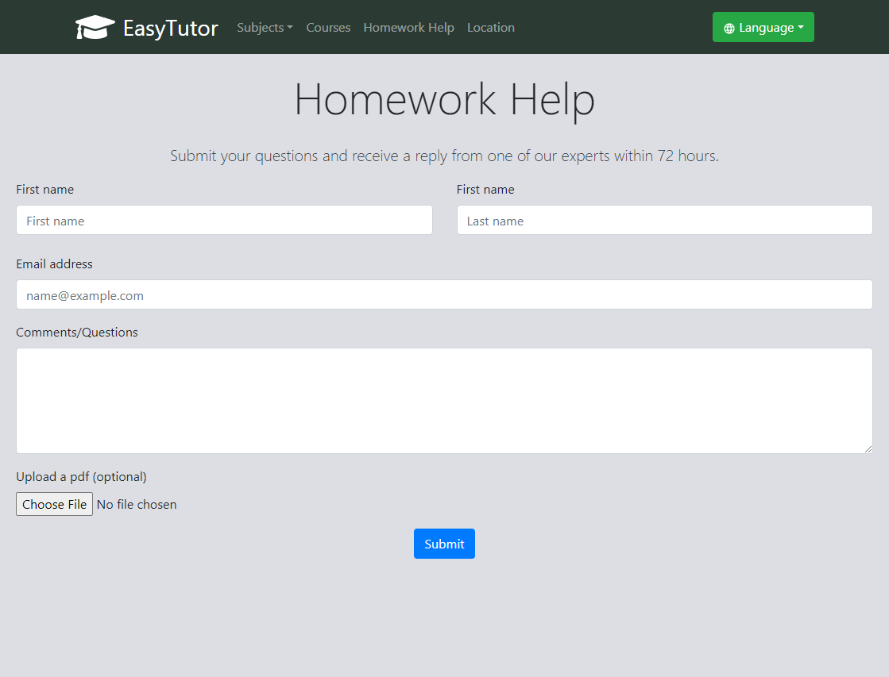

# EasyTutor

### A front-end user interface for advertising tutoring services to prospective students.

### 🔗 [**Live demo**]()

### Built using

- `React`
- `Boostrap`
- `JavaScript`
- `HTML`
- `CSS`

### Features

- View tutoring services available for all subjects and their prices.
- User information forms for booking a time slot with a tutor. 

### Screens

  
  

  
  

